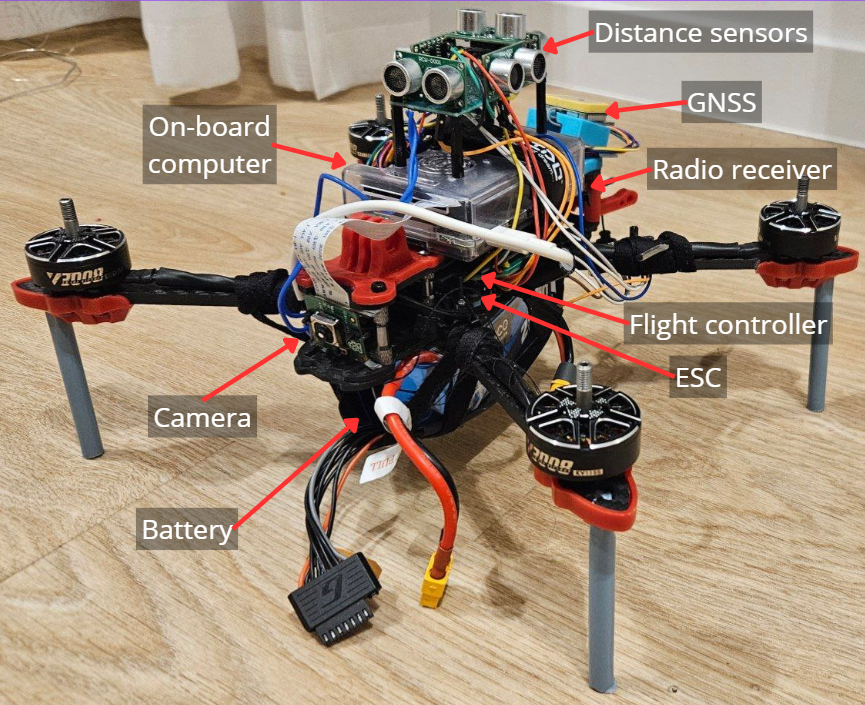
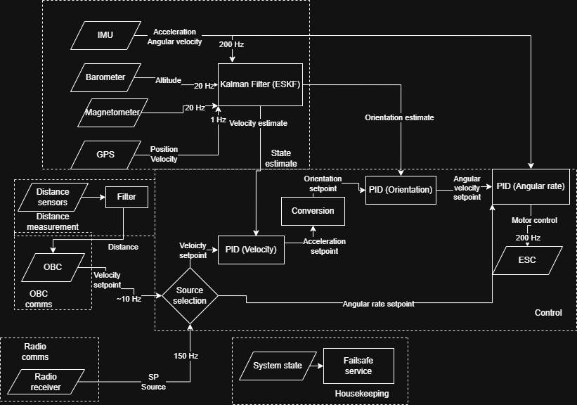

# FreeRTOS Flight Controller for Autonomous Drone

  


[](https://opensource.org/licenses/MIT)
[](https://www.st.com/en/microcontrollers-microprocessors/stm32f411.html)
[](https://www.freertos.org/)

This repository contains the **flight controller firmware** for an autonomous quadcopter designed to track a sport climber (as a part of an [engineering thesis](https://drive.google.com/file/d/1VNDckvFqOHmjKY-tU7kpDdDiWu2Gb9ya/view?usp=sharing)). The system runs on an STM32F411 microcontroller with FreeRTOS, providing deterministic real-time performance for sensor fusion, state estimation, and low-level control. It communicates with a companion computer (Raspberry Pi) via MAVLink and implements comprehensive safety features.


---

## ✨ Key Features

- **Real‑time multitasking** with FreeRTOS – tasks for sensor reading, state estimation, control, and communication.
- **Error‑State Kalman Filter (ESKF)** for attitude, velocity, and position estimation using IMU, magnetometer, barometer, and GNSS data.
- **Cascade PID control** – rate, angle, and velocity loops for precise and stable flight.
- **Multi‑sensor integration**:
  - MPU6050 (IMU) – gyroscope & accelerometer
  - QMC5883L (magnetometer)
  - BMP280 (barometer)
  - L76K (GNSS)
  - 6 × HC‑SR04 (ultrasonic distance sensors)
- **MAVLink communication** with companion computer for high‑level commands and telemetry.
- **Safety state machine** – arming checks, failsafe on connection loss, low battery, excessive tilt, and automatic landing.
- **DMA‑driven UART/I²C** for low‑CPU‑load sensor reading and radio communication (CRSF protocol).
- **Custom 2‑layer PCB** designed for noise immunity and compact integration.
- **Crossfire** protocol support for ExpressLRS control and telemetry

---

## 🧱 Hardware

| Component               | Model / Specification                          |
|-------------------------|------------------------------------------------|
| Microcontroller         | STM32F411CEU6 (WeAct Studio MiniF4)           |
| IMU                     | MPU6050                                        |
| Magnetometer            | QMC5883L                                       |
| Barometer               | BMP280                                         |
| GNSS                    | L76K                                           |
| Distance Sensors        | 6 × HC‑SR04                                    |
| Radio Receiver          | Radiomaster RP3 (CRSF protocol)                |
| Power Regulation        | Pololu D24V50F5 (5V, 5A step‑down)            |
| Frame                   | GEPRC Mark4 (7‑inch)                           |
| Motors / ESCs           | T‑Motor Velox V3008 / T‑Motor P60A             |

---

## 🏗️ Software Architecture

  
*Fig. 1: FreeRTOS task structure and data flow.*

The firmware is modular, with each hardware interface and algorithm isolated in its own driver or module. Tasks are prioritized as follows:

| Task               | Frequency | Priority | Description                             |
|--------------------|-----------|----------|-----------------------------------------|
| Sensor Acquisition | 1 kHz     | High     | Read IMU, barometer, magnetometer       |
| State Estimation   | 500 Hz    | High     | ESKF update and prediction              |
| Control Loop       | 500 Hz    | High     | Cascade PID (rate → angle → velocity)   |
| Distance Sensing   | 10 Hz     | Medium   | Poll HC‑SR04 sensors                     |
| MAVLink RX/TX      | Event‑driven | Medium | Communicate with companion computer     |
| Radio RX           | Event‑driven | High    | Decode CRSF frames                       |
| Safety Monitor     | 10 Hz     | Low      | Check battery, tilt, connection          |

All inter‑task communication uses FreeRTOS queues and mutexes to avoid race conditions. Memory allocation is static.

---

## ⚙️ Build & Flash

### Prerequisites
- ARM GCC toolchain (`arm-none-eabi-gcc`)
- CMake (≥ 3.10)
- OpenOCD or ST‑Link utility

### Build
```bash
git clone https://github.com/mboiar/FreeRTOS_FlightController.git
cd FreeRTOS_FlightController
mkdir build && cd build
cmake ..
make -j4
